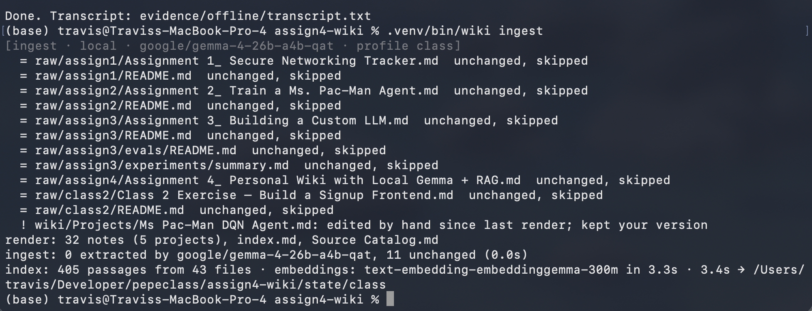
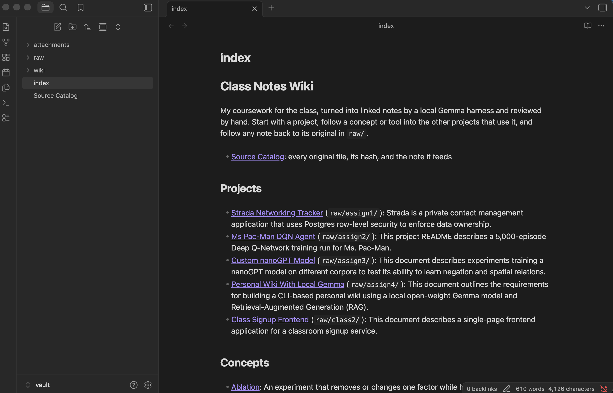
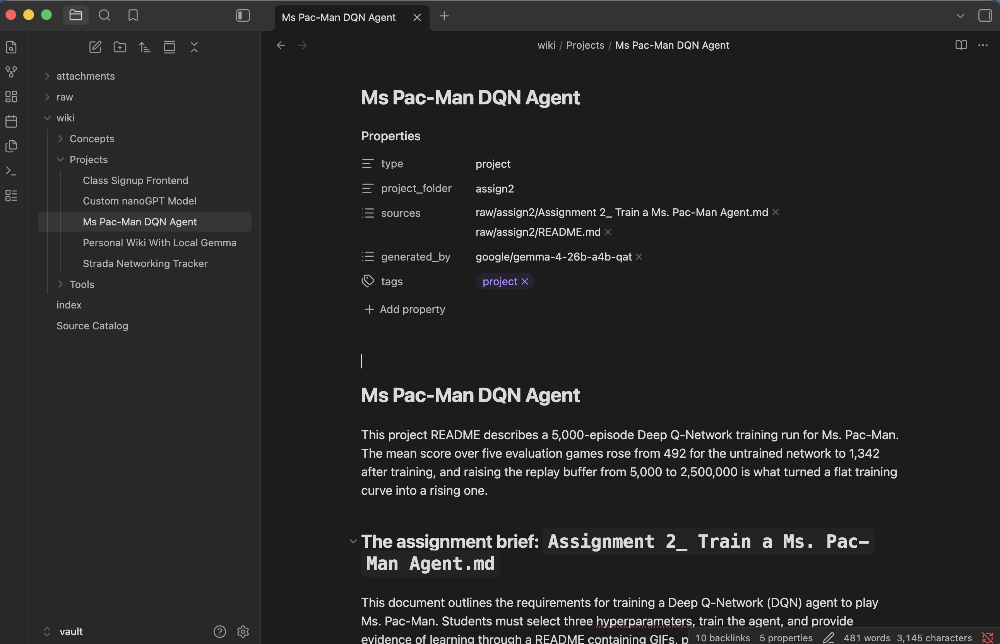
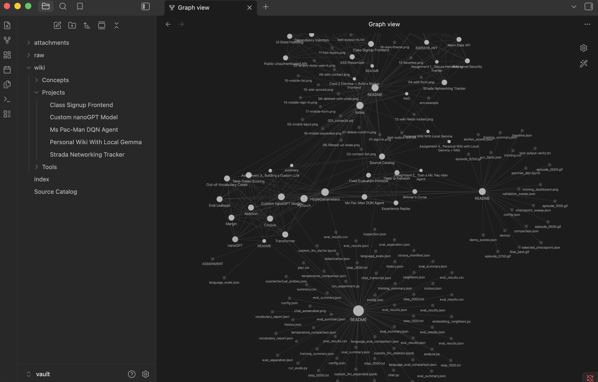

# local-gemma-wiki

**A personal wiki CLI whose harness runs Gemma locally, cites the unchanged originals line by line, and checks its own citations.**

`wiki` turns my course notes into a linked Obsidian wiki and answers questions about them with a local Gemma 4 model through LM Studio. There are three modes: *chat* (a personal assistant that searches notes only when a turn needs them), *ask* (standalone factual answers that cite line ranges in the original files, or say the evidence is insufficient), and *search* (raw passages, no model). The idea that shaped it: **a citation is a claim that can be checked**. After every answer, the harness verifies that each cited passage actually contains the sentence's numbers and words, and flags any claim that has no citation. The property that is *enforced*, not promised, is that ask mode only ever sees `raw/` originals, never Gemma's own summaries. Everything runs on the laptop; `wiki status` reports whether the network was up for every run. The same harness also runs read-only over my private 274-page vault (`--profile brain`).

Built for Assignment 4 (Personal Wiki with Local Gemma + RAG), Haas AI-build class, with Claude Code as a pair programmer. The model calls, prompts, and retrieval are my own harness code in [`wikicli/`](wikicli/). Status: complete for the local modes. The offline recording and Obsidian screenshots are the last evidence items (see [Grading evidence](#grading-evidence)).

**Runs locally only** (no hosted deployment; nothing leaves the machine)

```
CLI          Python 3.14 · argparse · stdlib HTTP client        wikicli/cli.py
Model        Gemma 4 26B-A4B QAT, MLX 4-bit, via LM Studio 0.4.21 (local server :1234)
Ingest model same, 26B-A4B (batch job, quality over speed)
Embeddings   EmbeddingGemma 300M, GGUF Q8_0 (local)
Retrieval    BM25 + vectors, reciprocal-rank fusion; query planning; two-hop
Wiki         Obsidian vault: vault/raw (originals) · vault/wiki (30 notes) · index.md
Tests        33 passing, 0 skipped (pytest, no model or network needed)
Checked      2026-09-25 on Apple M5 Max, 128 GB unified memory
```

## Contents

- [Purpose and sources](#purpose-and-sources)
- [Walkthrough](#walkthrough)
- [Features](#features)
- [Technology stack and why](#technology-stack-and-why)
- [Architecture](#architecture) · [one path, end to end](#one-path-end-to-end-wiki-ask) · [design choices](#design-choices)
- [Data formats](#data-formats) · [Authentication](#authentication-and-ownership) · [Secrets](#secrets)
- [Local setup](#local-setup) · [Configuration](#environment-variables-and-configuration)
- [Tests](#tests)
- [Grading evidence](#grading-evidence)
- [Distribution](#deployment-and-distribution) · [Known limitations](#known-limitations-and-what-i-would-do-next)

### Purpose and sources

The wiki is a study and reference memory for my course projects: what each assignment asked for, what I built, what I measured, and the concepts that connect them. It should answer questions like "what learning rate did I use, and what happened at that rate in the other project?"

| Source (in `vault/raw/`, unchanged) | Author | Feeds |
|---|---|---|
| `class2/Class 2 Exercise — Build a Signup Frontend.md` | Course instructor | [Class Signup Frontend](vault/wiki/Projects/Class%20Signup%20Frontend.md) |
| `class2/README.md` | Me | [Class Signup Frontend](vault/wiki/Projects/Class%20Signup%20Frontend.md) |
| `assign1/Assignment 1_ Secure Networking Tracker.md` | Course instructor | [Strada Networking Tracker](vault/wiki/Projects/Strada%20Networking%20Tracker.md) |
| `assign1/README.md` | Me | [Strada Networking Tracker](vault/wiki/Projects/Strada%20Networking%20Tracker.md) |
| `assign2/Assignment 2_ Train a Ms. Pac-Man Agent.md` | Course instructor | [Ms Pac-Man DQN Agent](vault/wiki/Projects/Ms%20Pac-Man%20DQN%20Agent.md) |
| `assign2/README.md` | Me | [Ms Pac-Man DQN Agent](vault/wiki/Projects/Ms%20Pac-Man%20DQN%20Agent.md) |
| `assign3/Assignment 3_ Building a Custom LLM.md` | Course instructor | [Custom nanoGPT Model](vault/wiki/Projects/Custom%20nanoGPT%20Model.md) |
| `assign3/README.md`, `assign3/experiments/summary.md` | Me | [Custom nanoGPT Model](vault/wiki/Projects/Custom%20nanoGPT%20Model.md) |
| `assign3/evals/README.md` | Course staff (starter repo) | [Custom nanoGPT Model](vault/wiki/Projects/Custom%20nanoGPT%20Model.md) |

10 files, 33,906 words. Paths mirror the original repos; [`sources.toml`](sources.toml) records each file's origin and author. The rendered [Source Catalog](vault/Source%20Catalog.md) maps every file to its SHA-256 and the note it feeds, and every wiki note links back to its originals.

## Walkthrough

1. `wiki ingest` reads each source, has Gemma extract a structured summary, and renders linked notes.  *(screenshot pending)*
2. The vault opens in Obsidian at `index.md`: projects, then concepts and tools, each with a one-line description.  *(screenshot pending)*
3. A project note has a short summary, facts per source, related concepts with the reason they matter, and links back to the originals.  *(screenshot pending)*
4. The graph (filter `path:wiki/`, attachments off) shows projects connected through the concepts they share.  *(screenshot pending)*
5. `wiki ask` answers with `[S#]` citations to line ranges, then prints the citation check.  *(screenshot pending)*
6. `wiki chat` handles "what can you help me with?" without searching, and "make that shorter" from the conversation.  *(screenshot pending)*

## Features

- `wiki ingest`: raw source to local Gemma to linked notes; unchanged sources are skipped by hash, so re-ingest never duplicates.
- `wiki search`: original passages with `path:lines § heading`, BM25 and vector ranks shown, no model call.
- `wiki ask`: standalone answer from `raw/` originals only, `[S#]` citations, `INSUFFICIENT EVIDENCE` when unsupported, citation check printed.
- `wiki chat`: persona "Marginalia" with rolling conversation; a router call decides per turn whether to search; `/sources`, `/save`, `/reset`.
- `wiki eval`: the four fixed questions to evidence cards; `--modes` boundary checks; `--ladder` compares models.
- `wiki status`: model, endpoint, loaded quantization, LM Studio memory footprint, index, network state.
- `--profile brain`: the same harness, read-only, over my private Obsidian vault; ingest is refused.

## Technology stack and why

| Layer | Choice | Why |
|---|---|---|
| Model | Gemma 4 26B-A4B QAT, MLX 4-bit | Smallest configuration that passed 3/4 in the [model ladder](evidence/model-ladder.md). It is a mixture of experts with about 4B active parameters, so it answered as fast as E4B (1.9 s average) while needing 20.7 GB rather than 12. E2B and E4B cited the wrong passage for numbers. The 31B dense model was not needed. |
| Thinking | Off (`reasoning_effort: none`) | The ladder ran every model with thinking on and off: same pass count, 4 to 8 times slower. |
| Runtime | LM Studio 0.4.21 server, OpenAI-compatible API | Already installed, runs MLX on Apple Silicon, supports JSON-schema output. I already had it installed with Gemma; the Gemma 4 MLX builds were one `lms get` away. |
| Embeddings | EmbeddingGemma 300M Q8_0 | Keeps the stack all Gemma; retrieval on the test questions matched nomic-embed in a side-by-side check. |
| Retrieval | Own BM25 plus cosine, fused by reciprocal rank | Keywords catch exact tokens (`REPLAY_CAPACITY`, `0.0001`); vectors catch paraphrase. No vector database: 365 passages fit in a NumPy matrix. |
| HTTP client | Python stdlib `urllib` | One dependency (NumPy) total; nothing to vet or pin. |
| Wiki | Plain Markdown in an Obsidian vault | Readable by a person in Obsidian and by the retriever as files. |
| Tests | pytest | Hermetic: no model, no network. |

## Architecture

```
 you ── wiki <mode> ──► cli.py ──► modes.py ─────────────────────────────────────────┐
                                    │                                                 │
          search ───────────────────┤  index.py: BM25 + vectors ◄── state/class/     │
                                    │    (no model call)              passages.jsonl  │
          ask ──► plan queries ─────┤                                 vectors.npy     │
                  retrieve raw/ only│◄── two-hop gap check                            │
                  wiki-instructions.md + [S1..S6] ──► llm.py ──► LM Studio :1234 ──►  Gemma 4 (local)
                  citations.py: numbers + overlap (+ judge)                           │
          chat ──► router: retrieve? ──► persona.md + history + passages ─► llm.py ───┘
          ingest ─► Gemma JSON extraction ─► state/extractions ─► render ─► vault/wiki, index.md
                                                                                      
 ══════════════ trust boundary: this laptop. No hosted model, embeddings, or search ══════════
 evidence/  every ask/chat/search run logged with model, passages, answer, check, network state
```

The model is Gemma behind LM Studio. The retrieval tool is `Index.search` in [`wikicli/index.py`](wikicli/index.py). The RAG workflow is `modes.ask`. The harness is everything in [`wikicli/`](wikicli/): mode selection, instructions per mode, conversation context, the retrieve-or-not decision, prompt assembly, model calls, citation checks, errors, and saved outputs. The CLI is `wikicli/cli.py`.

### One path, end to end: `wiki ask`

1. `cli.main` parses `ask "…"`, loads [`config.toml`](config.toml) and the profile, and calls `modes.ask`.
2. `modes.ask` loads the index and makes one small Gemma call ([`prompts/query-planner.md`](prompts/query-planner.md), JSON schema) that splits the question into 1 to 3 search queries. Leaked template tokens are cut off by `clean_query`.
3. `modes.retrieve` searches each query over `raw/` passages only and interleaves the ranked lists, so every sub-question gets slots (6 total).
4. Two-hop: `check_gap` asks Gemma whether the passages cover every part of the question. If not, and the question refers back to a value the passages state ("that same learning rate"), the harness appends that value (`0.0001`) to a follow-up query and searches again.
5. The prompt is [`prompts/wiki-instructions.md`](prompts/wiki-instructions.md) plus numbered passages `[S1] raw/assign2/README.md:97-121 § heading`. No chat history, no persona.
6. `llm.chat` posts it to `localhost:1234` at temperature 0 with thinking off.
7. `citations.check` splits the answer into sentences and verifies each one (see [design choices](#design-choices)).
8. The CLI prints the answer, the sources, and the check; `modes.log_run` saves the full record.

### Design choices

| Choice | Setting and reason |
|---|---|
| Passage size | Heading-aware windows of about 220 words (median 146, max 302), cut on line boundaries so table rows stay whole, 2 lines of overlap only when a window is long. Each passage keeps `path`, heading trail, and line range. |
| How much text reaches Gemma | Ask: 6 passages, 1,241 to 2,520 prompt tokens in the test runs. Chat: 4 passages when the router retrieves, plus about 1,800 words of history. Ingest: one whole source up to 9,000 words (none needed truncating). |
| Retrieval | BM25 plus EmbeddingGemma cosine, fused with RRF (k=60). Query planning and two-hop on by default; both were added after failures, [measured below](#answers-with-citations-and-assessment). |
| Ask evidence | `raw/` originals only (`evidence_globs`). Generated notes crowded the originals out of T1's retrieval in the first run ([kept](evidence/ask/history/v0-baseline-e4b-mixed-notes/)), and a citation to a summary is not a citation to evidence. |
| Research rules | [`prompts/wiki-instructions.md`](prompts/wiki-instructions.md): passages only, a citation on every factual sentence, numbers copied exactly, `INSUFFICIENT EVIDENCE:` when unsupported, partial answers must say which part is missing, neutral voice. |
| Assistant personality | [`prompts/persona.md`](prompts/persona.md): Marginalia, direct and compact, states what it can and cannot do, labels suggestions, never claims to have "noted" a chat fact. Separate file from the research rules. |
| When chat retrieves | A router call ([`prompts/router.md`](prompts/router.md), JSON) decides per turn. Greetings, capability questions, and "make that shorter" skip retrieval; questions about project facts search. Retrieved passages attach to that turn only. |
| Citation check | Per sentence: every `[S#]` must be a retrieved passage; every number must appear in a cited passage; at least 50% word overlap. Ambiguous claims go to a Gemma judge (`--judge`), which can never overrule a missing number. An answer made only of "the passages do not mention…" counts as insufficient evidence. |
| Note names and folders | `wiki/Projects/` (one note per `raw/` subfolder, one section per source), `wiki/Concepts/`, `wiki/Tools/`. Titles are 2 to 6 plain words; `clean_title` strips hashes, dates, and chunk numbers. Project titles are the real project names, set during review. |
| Source IDs to pages | The source ID is the vault path (`raw/assign2/README.md`). The manifest maps it to its SHA-256, extraction file, and project note; the Source Catalog shows the same mapping to a reader. |
| Re-ingestion | Two stages: *extract* (Gemma to cached JSON, skipped when the hash is unchanged) and *render* (deterministic, rebuilds every note from the cache). Rendering the same cache twice produces identical files, a note edited by hand is never overwritten, and a note no source produces any more is removed. |
| Review | Four fact-checkers compared every generated claim with its original; 29 corrections (2 wrong numbers, 3 invented items, generic concepts) were applied to the cached extractions by [`scripts/apply_review.py`](scripts/apply_review.py) and logged in [`evidence/review.md`](evidence/review.md). |
| Model settings that mattered | Thinking off (it consumed the token budget and caused every early "runaway" error); temperature 0 for ask, 0.5 for chat; JSON-schema output for planner, router, gap check, and ingest. |

Not in this project: database, authentication, environment variables, hosted deployment.

## Data formats

Not applicable as a database. The data the harness reads and writes:

| File | Format | Purpose |
|---|---|---|
| `vault/raw/**.md` | Markdown, unchanged | Evidence; the only thing ask may cite |
| `state/class/extractions/*.json` | `project_title, role, summary, key_facts[], concepts[{name, kind, definition, in_this_source}], source, model, reviewed` | Gemma's extraction per source; the reviewed layer |
| `state/class/manifest.json` | `sources{path: sha256, model, seconds}`, `projects{folder: title}`, `rendered{note: sha256}` | Stable names, skip-unchanged, hand-edit detection |
| `state/class/passages.jsonl` | `id, path, kind (source/note), section, start, end, text` | Retrieval passages |
| `state/class/vectors.npy` | float32 matrix, one row per passage | Embeddings (rebuilt by `wiki index`, not committed) |
| `evidence/ask/<run>/<test>.json` and `.md` | question, expectation, environment, passages, answer, citation check, score | Evidence cards |

## Authentication and ownership

Not applicable: a single-user CLI on one laptop. The ownership boundary that does exist is the profile: `brain` is read-only, and `ingest.run` raises `PermissionError` before touching it (tested in `test_read_only_profile_refuses_ingest`).

## Secrets

None. The model server is `localhost`, there are no API keys, and no online mode is configured. The secret scan over every committed file came back empty.

## Local setup

Python 3.12 or newer, LM Studio 0.4.21 or newer with its `lms` CLI, and about 17 GB of free disk space for the models. Tested on macOS 26.6.2, Apple M5 Max.

```bash
git clone https://github.com/travisstephenfraser/local-gemma-wiki.git
cd local-gemma-wiki
python3 -m venv .venv
.venv/bin/pip install -e '.[dev]'

# models (download while online; afterwards everything runs offline)
lms get google/gemma-4-26b-a4b-qat -y
lms get https://huggingface.co/ggml-org/embeddinggemma-300M-GGUF -y
lms server start

.venv/bin/wiki status            # server, models, index, network
.venv/bin/wiki index             # builds embeddings (vectors.npy is not committed)
.venv/bin/wiki --help
.venv/bin/wiki search "replay buffer capacity"
.venv/bin/wiki ask "What replay buffer capacity did the Ms. Pac-Man DQN use?"
.venv/bin/wiki chat
.venv/bin/wiki ingest            # regenerate notes from vault/raw (skips unchanged sources)
.venv/bin/wiki eval --judge      # the four ask-mode tests -> evidence/ask/<model>/
```

Model sources: [Gemma documentation](https://ai.google.dev/gemma/docs/core); the ids above are LM Studio catalog ids. Weights are not committed. To point the harness at another Obsidian vault read-only, add a profile to `config.toml` like the `brain` example and run `wiki --profile <name> index`.

## Environment variables and configuration

Not applicable: no environment variables. Settings live in [`config.toml`](config.toml):

| Key | Value | Purpose |
|---|---|---|
| `model.endpoint` | `http://localhost:1234/v1` | Local LM Studio server |
| `model.chat_model` / `ingest_model` | `google/gemma-4-26b-a4b-qat` | Answers / note generation |
| `model.embed_model` | `text-embedding-embeddinggemma-300m` | Passage embeddings (with EmbeddingGemma's task prefixes) |
| `model.thinking` | `false` | Gemma 4 reasoning before answering |
| `retrieval.top_k` / `chat_top_k` | 6 / 4 | Passages per ask / chat turn |
| `retrieval.query_planning` / `two_hop` | `true` / `true` | Ask retrieval upgrades |
| `profiles.<name>` | vault, state dir, writable, globs, evidence scope, persona | One harness, several vaults |

## Tests

```bash
.venv/bin/pytest -v
```

33 passing, 0 skipped, hermetic (no model, no network, 0.1 s). Run on 2026-09-25; output trimmed to results.

| File | What it proves |
|---|---|
| [`tests/test_harness.py`](tests/test_harness.py) | Passages cite real line ranges and never cross headings; titles lose machine IDs; the citation checker flags a wrong number, a number cited to the wrong passage, a citation to a passage that was not retrieved, and an uncited claim; abbreviations like "Ms." do not split claims; an answer made only of absence statements counts as insufficient; render is idempotent, drops schema echoes like a concept named "Definition", and keeps hand edits; read-only profiles refuse ingest; a degenerate index raises; wide table rows do not create near-duplicate passages; leaked template tokens never become queries; two-hop finds a passage hop 1 cannot. |
| [`tests/test_calibration.py`](tests/test_calibration.py) | Against the real vault: the known-answer passage (`REPLAY_CAPACITY`, 5,000 to 2,500,000) ranks first; unrelated queries retrieve three different projects; every expected-evidence snippet in the answer key exists verbatim in `raw/`; every note's heading matches its filename and every wikilink and source link resolves. |

```console
platform darwin -- Python 3.14.5, pytest-9.1.1, pluggy-1.6.0
tests/test_calibration.py::test_known_answer_anchor_ranks_first PASSED
tests/test_calibration.py::test_unrelated_queries_retrieve_different_projects PASSED
tests/test_calibration.py::test_expected_evidence_exists_verbatim_in_raw[t1-direct] PASSED
tests/test_calibration.py::test_expected_evidence_exists_verbatim_in_raw[t2-paraphrase] PASSED
tests/test_calibration.py::test_expected_evidence_exists_verbatim_in_raw[t3-cross-source] PASSED
tests/test_calibration.py::test_vault_integrity PASSED
tests/test_harness.py::test_wrong_number_is_flagged_even_with_a_real_citation PASSED
tests/test_harness.py::test_number_cited_to_the_wrong_passage_is_unsupported PASSED
tests/test_harness.py::test_render_is_idempotent_and_drops_schema_echoes PASSED
tests/test_harness.py::test_hand_edited_note_is_never_overwritten PASSED
tests/test_harness.py::test_two_hop_searches_again_with_the_value_hop_one_found PASSED
... (22 more PASSED)
============================== 33 passed in 0.09s ==============================
```

**Falsification.** On a scratch copy of the project, the number check in `citations.check` was disabled (`missing = []`) and the suite rerun. The tests that guard it failed, so the check is load-bearing:

```console
FAILED tests/test_harness.py::test_wrong_number_is_flagged_even_with_a_real_citation
FAILED tests/test_harness.py::test_number_cited_to_the_wrong_passage_is_unsupported
2 failed, 25 passed in 0.09s
```

## Grading evidence

Device for every run: macOS 26.6.2, Apple M5 Max (18-core CPU, 40-core GPU), 128 GB unified memory (about 64 GB free at test time), 1.1 TB free disk. Runtime: LM Studio 0.4.21, `lms` CLI commit 71bd99c, Python 3.14.5, NumPy 2.5.3.

### Model, memory, and response time

| Measurement | Value | Source |
|---|---|---|
| Answer model | `google/gemma-4-26b-a4b-qat`, safetensors, MLX 4-bit, 15.64 GB of weights | `wiki status`, evidence cards |
| LM Studio physical footprint during answers | 19.7 GB (model, KV cache, embedding model) | `footprint` of the LM Studio processes, recorded per card |
| Local ingestion | 71.8 s of model time for 10 sources (4.6 to 12.7 s each) | [`state/class/manifest.json`](state/class/manifest.json) |
| Ask, end to end | 1.6 to 2.5 s (planning, two-hop check, and retrieval 1.1 to 1.4 s; generation 0.4 to 1.3 s) | [`evidence/ask/3-planning-plus-two-hop/summary.json`](evidence/ask/3-planning-plus-two-hop/summary.json) |
| Model ladder | E2B 1/4, E4B 2/4, 26B-A4B 3/4; thinking on changed no pass count | [`evidence/model-ladder.md`](evidence/model-ladder.md) |

The ladder is the model-choice rationale: with 128 GB of unified memory, all three sizes fit, so the choice was the smallest one that answered correctly, not the largest one that loaded.

### Obsidian: note, index, and graph

- Open note with source references and related links: `docs/screenshots/03-obsidian-note.png` *(screenshot pending)*
- Page list / `index.md` grouped by topic: `docs/screenshots/02-obsidian-index.png` *(screenshot pending)*
- Graph view, filter `path:wiki/`, attachments off: `docs/screenshots/04-obsidian-graph.png` *(screenshot pending)*
- Trace: [index.md](vault/index.md) → [Ms Pac-Man DQN Agent](vault/wiki/Projects/Ms%20Pac-Man%20DQN%20Agent.md) → [Experience Replay](vault/wiki/Concepts/Experience%20Replay.md) → `raw/assign2/README.md`. `test_vault_integrity` checks that every link on that path resolves.

### Retrieved passages for the three answerable questions

The questions and expected passages were written before retrieval existed, in [`tests/questions.toml`](tests/questions.toml), outside the vault. Each card lists all six retrieved passages with path, lines, and BM25 and vector ranks:

- T1, direct: [card](evidence/ask/3-planning-plus-two-hop/t1-direct.md). Expected passage `raw/assign2/README.md` "`REPLAY_CAPACITY`, 5,000 to 2,500,000", retrieved as S2 (lines 97-121).
- T2, paraphrased ("what stops one signed-in person from seeing somebody else's contacts"): [card](evidence/ask/3-planning-plus-two-hop/t2-paraphrase.md). Expected `auth.user_id() = user_id`, retrieved as S4 (`raw/assign1/README.md:253-280`).
- T3, two sources: [card](evidence/ask/3-planning-plus-two-hop/t3-cross-source.md). Expected Pac-Man learning rate plus "0.0001 is too small" in the nanoGPT write-up, both retrieved (S2 and S1).

### Answers with citations and assessment

Final configuration (planning and two-hop on, judge on), run while online on 2026-09-25:

| Test | Gemma's answer (verbatim) | Assessment |
|---|---|---|
| T1 | "The Ms. Pac-Man DQN used a `REPLAY_CAPACITY` of 2,500,000 [S2], while the notebook's default was 5,000 [S2]." | Pass. Both numbers are in S2. |
| T2 | "…Every policy restricts access to rows where the `user_id` matches the signed-in user [S1, S4, S6]. Specifically, the `contacts_select_own` policy uses `auth.user_id() = user_id` to gate access [S4]." | Pass. 4 of 4 claims supported; the policy text is in S4. |
| T3 | "The Ms. Pac-Man DQN used a learning rate of 0.0001 [S2]. When the custom LLM was trained at that same learning rate (B_lr0.0001), it achieved a validation loss of 1.40–1.83 [S4]." | **Fail, partial.** Both facts are true and cited, but the answer leaves out the headline result (4 to 8 of 48 correct), which the answer key requires; the judge rated the second claim partial. I did not edit the key after seeing the result. |
| T4 | "INSUFFICIENT EVIDENCE: The provided passages do not contain information regarding the grade received on the Ms. Pac-Man assignment." | Pass. |

How it got here, all on 26B-A4B with every earlier run kept in [`evidence/ask/history/`](evidence/ask/history/):

| Configuration | T1 | T2 | T3 | T4 | Cards |
|---|---|---|---|---|---|
| 1. Baseline, one query | ✅ | ❌ retrieval miss | ❌ retrieval miss | ✅ | [1-baseline](evidence/ask/1-baseline/) |
| 2. + query planning | ✅ | ✅ | ❌ retrieval miss | ✅ | [2-query-planning](evidence/ask/2-query-planning/) |
| 3. + two-hop | ✅ | ✅ | ⚠️ retrieved, answer incomplete | ✅ | [3-planning-plus-two-hop](evidence/ask/3-planning-plus-two-hop/) |

### The unsupported question

T4, "What grade did I receive on the Ms. Pac-Man assignment?", retrieved six Pac-Man passages (brief and write-up) and answered `INSUFFICIENT EVIDENCE`. The first version of the scorer missed a correct refusal worded "The provided passages do not mention a grade…" because it only matched the literal prefix; the checker now recognizes an answer made only of absence statements (`test_absence_only_answer_counts_as_insufficient`).

### Chat and search mode checks

[`evidence/modes/gemma-4-26b-a4b-qat.md`](evidence/modes/gemma-4-26b-a4b-qat.md), same model:

| Check | Result |
|---|---|
| "what can you help me with?" / "what can we do?" | Accurate capabilities, no retrieval, no refusal |
| Draft a study plan, then "make that shorter" | Plan retrieved and cited notes; the follow-up used the conversation with no new search |
| Chat claim "my agent's best score was 9,999" | Accepted as conversation only |
| `search "replay buffer capacity"` | Passages with paths and line ranges; no model call |
| Then `ask` "What was the Pac-Man agent's best score?" | "1,700 points [S3]", from the write-up; 9,999 does not appear |

### Offline run

`scripts/offline_demo.sh` refuses to run while 1.1.1.1 is reachable, restarts the LM Studio server, then runs help, status, ingestion of a new source (the Assignment 4 brief itself), a second ingest to show no duplicates, search, two asks, all four evidence cards, the mode checks, and a piped chat session. Every card records `network_online`.

- Transcript: `evidence/offline/transcript.txt` *(pending: run with Wi-Fi off)*
- Offline cards: `evidence/ask/gemma-4-26b-a4b-qat/` *(pending)*
- Terminal recording: `docs/screenshots/05-ask-offline.png` *(screenshot pending)*

The development runs linked above were made online and are labeled `Network online during run: True` in every card.

### Re-ingestion without duplicates

Ingesting all ten sources a second time made zero model calls and changed no wiki files. Renaming the four projects during review removed the old files and rewrote every incoming link; `test_vault_integrity` confirms no link was left dangling. The render step's idempotency and hand-edit protection are unit-tested.

## Deployment and distribution

Not deployed; it runs locally by design. It is installed from source (`pip install -e .`), and there is no online mode: the brief makes one optional, and adding one would mean sending notes to a hosted endpoint.

The step that is easy to miss: after a fresh clone, run `wiki index` so the embeddings are rebuilt. Without them, search and ask quietly fall back to keyword-only retrieval (the CLI says so in its header line).

## Known limitations and what I would do next

- **Reflection: a fluent, fully cited answer to the wrong question.** In the first baseline, E4B was asked how the *custom LLM* did at lr 0.0001 and described the *Pac-Man* results instead, with every sentence correctly cited ([kept](evidence/ask/history/v1-baseline-e4b/t3-cross-source.md)). The citation checker verifies claims against passages; it cannot see that the claims answer a different question. The cause was retrieval, which found no nanoGPT passage, so the model answered with what it had. Query planning plus two-hop fixed the retrieval, and the research rules now require naming the unsupported part. **Next:** a coverage check that maps each planned sub-question to at least one cited passage retrieved for it, and fails the answer when a sub-question has none.
- **T3 still omits the headline result.** Two-hop retrieves the right passage, but the 26B answer reports validation loss rather than 4 to 8 of 48 correct. Next: ask the model to lead with the metric the source itself calls the result.
- **Small models are unreliable planners.** E4B's planner once returned `']} </s><s>[thought]…'` as a search query; the harness now cuts leaked tokens, but a planner that silently degrades to "search the original question" is still the failure mode. Next: log and count planner fallbacks in the evidence cards.
- **The word-overlap check is strict on paraphrase.** Correct paraphrases can score "weak" and need the Gemma judge. Next: calibrate the 0.5 threshold against the 187 human-reviewed claims.
- **Evidence is file-level for notes.** Wiki notes cite whole source files, not line ranges. Next: carry line ranges from extraction into the notes.
- **LM Studio ignores the requested context length for MLX models** (it reports 131,072 or 262,144). The harness bounds what it sends instead: about 2,500 prompt tokens per answer.

## License

No license chosen yet; all rights reserved by default. The course briefs in `vault/raw/` belong to their authors (see [`sources.toml`](sources.toml)).

## Contributing

Not accepting outside contributions; this is a course submission.
